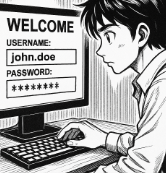

# T01: Gestor de contrasenyes
🚨Alerta!! EverPia ha estat atacada per ciberdelinqüents. La consultora on esteu de becaris ha patit una fuita d’informació (data breach) i informació confidencial sobre un projecte que està en fase de desenvolupament està ara en mans de delinqüents que amenacen amb publicar-la si no es paga un rescat.

Òbviament, això ha causat una gran alarma dins la companyia i s’ha creat un comitè de crisi per gestionar la situació. 
La investigació interna ha revelat que un dels comptes tècnics va ser compromès a causa de l'ús d'una contrasenya feble o reutilitzada.

🧭 Com a resposta a aquesta crisi, la Direcció Tècnica ha emès una directriu: tot el personal tècnic ha de començar a utilitzar un gestor de contrasenyes validat per garantir l'ús de credencials úniques i robustes. Se us encarrega la tasca d'avaluar les opcions i crear la documentació necessària per a la formació del personal.

## Solució

A l'arxiu [solució-Fase1.md](solució-Fase1.md)  hi ha la solució de la Fase 1: Anàlisi i Justificació (Document d'Informe)

A l'arxiu [solució-Fase2.md](solució-Fase2.md)  hi ha la solució de la Fase 2: Guia d'Ús Tècnica (Manual Operatiu)

[Torna a la pàgina del projecte](../README.md)
