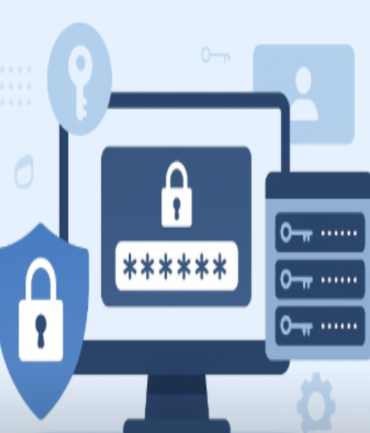

# Solució: T01: Gestor de contrasenyes - Fase 1: Anàlisi i Justificació (Document d'Informe)

 👤 Autor: Jhon Justiniano
 🏫 Curs: SMX-B
 🔒 Mòdul: Seguretat Informàtica

# 🧾 ÍNDEX 
- 1.Introducció
- 2.Introducció i justificació
  - 2.1.Explicació de perquè les contrasenyes febles o reutilitzades són un risc crític per a l'empresa (atac de diccionari, credential stuffing, etc.)
  - 2.2.La funció crucial d'un gestor de contrasenyes per mitigar aquests riscos.
- 3.Comparativa tècnica
  - 3.1.Taula comparativa
- 4.Avantatges i Inconvenients: Resumiu els principals pros i contres de cada model (online vs. offline) des del punt de vista de seguretat, usabilitat i continuïtat del negoci
- 5.Recomanació: Concloeu l'informe escollint l'eina que considereu més adequada per al personal tècnic de l'empresa i justifiqueu la vostra elecció

# 🧭 Introducció
⚠️ Alerta!! EverPia ha estat atacada per ciberdelinqüents. La consultora on esteu de becaris ha patit una fuita d’informació (data breach) i informació confidencial sobre un projecte que està en fase de desenvolupament està ara en mans de delinqüents que amenacen amb publicar-la si no es paga un rescat.
Òbviament, això ha causat una gran alarma dins la companyia i s’ha creat un comitè de crisi per gestionar la situació. 
La investigació interna ha revelat que un dels comptes tècnics va ser compromès a causa de l'ús d'una contrasenya feble o reutilitzada.
!
