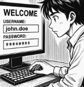

# Solució: T01: Gestor de contrasenyes - Fase 1: Anàlisi i Justificació (Document d'Informe)

👤 Autor: Jhon Justiniano
🏫 Curs: SMX-B
🔒 Mòdul: Seguretat Informàtica

# 🧾 ÍNDEX 
- 1.Introducció
- 2.Introducció i justificació
  - 2.1.Explicació de perquè les contrasenyes febles o reutilitzades són un risc crític per a l'empresa (atac de diccionari, credential stuffing, etc.)
  - 2.2.La funció crucial d'un gestor de contrasenyes per mitigar aquests riscos.
- 3.Comparativa tècnica
  - 3.1.Taula comparativa
- 4.Avantatges i Inconvenients: Resumiu els principals pros i contres de cada model (online vs. offline) des del punt de vista de seguretat, usabilitat i continuïtat del negoci
- 5.Recomanació: Concloeu l'informe escollint l'eina que considereu més adequada per al personal tècnic de l'empresa i justifiqueu la vostra elecció

# 🧭 1.Introducció
⚠️ Alerta!! EverPia ha estat atacada per ciberdelinqüents. La consultora on esteu de becaris ha patit una fuita d’informació (data breach) i informació confidencial sobre un projecte que està en fase de desenvolupament està ara en mans de delinqüents que amenacen amb publicar-la si no es paga un rescat.
Òbviament, això ha causat una gran alarma dins la companyia i s’ha creat un comitè de crisi per gestionar la situació. 
La investigació interna ha revelat que un dels comptes tècnics va ser compromès a causa de l'ús d'una contrasenya feble o reutilitzada.

💡 Com a resposta a aquesta crisi, la Direcció Tècnica ha emès una directriu: tot el personal tècnic ha de començar a utilitzar un gestor de contrasenyes validat per garantir l'ús de credencials úniques i robustes. Se us encarrega la tasca d'avaluar les opcions i crear la documentació necessària per a la formació del personal.

# 🧩 2.Introducció i justificació
## 📖 2.1.Explicació de perquè les contrasenyes febles o reutilitzades són un risc crític per a l'empresa (atac de diccionari, credential stuffing, etc.).

En el món digital i en l’entorn digital actual, la seguretat de les credencials d’accés és molt important i fonamental per la protecció de la informació de l'empresa. Les contrasenyes fluixes, reutilitzades representen un risc molt alt per a l'empresa.

- 🧠 Atacs de diccionari: Els atacants utilitzen algunes llistes de paraules comunes per a poder endevinar les contrasenyes, aquest mètode es fa contra les contrasenyes simples o sobre les contrasenyes basades en les paraules habituals.

- 💥 Credencial stuffing: Aquesta tècnica consisteix en el fet que els atacants proven combinacions de correus electrònics i les contrasenyes envoltades d'altres serveis, ja que molts usuaris realitzen les mateixes credencials en plataformes.

- 🎭 Phishing i enginyeries socials: Els usuaris poden ser enganyats per a revelar les seves contrasenyes.

## 🧰 2.2.La funció crucial d'un gestor de contrasenyes per mitigar aquests riscos.

Les funcions principals són:
- 🧬 Generació automàtica de contrasenyes: Evita l'ús de les contrasenyes fluixes o que són previsibles.
- 🔐 Emmagatzematge segur: les contrasenyes es desen en un entorn xifrat, la qual cosa protegeix contra els accessos no autoritzats.
- 🧱 Autenticació multifactor: Molts dels gestors de contrasenyes tenen integrat un sistema d'autenticació per a afegir una capa addicional de seguretat.
- 📊 Auditories i control d'accessos: El que fa és que permet que l'administració pugui supervisar l'ús de les credencials.
- ⚙️ Facilitat d'ús i eficiència: Redueix el temps dedicat a recuperar o recordar les contrasenyes.

# ⚖️ 3. Comparativa Tècnica
## ⚖️ 3.1.Realitzeu una taula comparativa 

- Bitwarden (Alternativa Online / Núvol): Analitzeu la sincronització, el model de seguretat (xifratge end-to-end), la facilitat d'accés des de múltiples dispositius i el cost/model freemium.
- KeePassX / KeePassXC (Alternativa Offline / Escriptori): Analitzeu l'emmagatzematge local de l'arxiu (KDBX), la independència del núvol, el model open source i la portabilitat de l'arxiu.

| **Característica**                             | **Bitwarden (Online / Núvol)**                                                                       | **KeePassXC (Offline / Escriptori)**                                                    |
|------------------------------------------------|-------------------------------------------------------------------------------------------------------|-----------------------------------------------------------------------------------------|
| **Sincronització**                             | Automàtica entre dispositius via núvol (web, mòbil, escriptori, extensions)                           | No hi ha sincronització automàtica. L’usuari gestiona manualment l’arxiu KDBX          |
| **Model de Seguretat**                         | Xifratge end-to-end amb multifactor (AES-256, PBKDF2/Argon2, TLS, zero knowledge)                    | Xifratge local amb AES-256; l’arxiu KDBX en control total de l’usuari                 |
| **Accés Multidispositiu**                      | Disponible en web, mòbil (iOS/Android), escriptori (Windows/macOS/Linux), CLI, extensions             | Disponible en escriptori (Windows/macOS/Linux); no hi ha aplicacions mòbils oficials   |
| **Model Freemium / Cost**                      | Model freemium amb funcionalitats bàsiques gratuïtes; plans de pagament per empreses i equips          | Totalment gratuït i de codi obert; sense subscripcions ni serveis de pagament          |
| **Emmagatzematge de dades**                    | Núvol (Bitwarden Cloud o autoallotjament amb Docker)                                                  | Local (arxiu KDBX que pot ser emmagatzemat en qualsevol ubicació, inclòs núvol privat) |
| **Codi Font / Llicència**                      | Codi obert, disponible per contribució                                                                 | Codi obert sota llicència GPLv3                                                        |
| **Portabilitat de l’arxiu**                   | Vault sincronitzat automàticament entre dispositius                                                    | Arxiu KDBX portàtil; es pot copiar, moure o sincronitzar manualment                    |

# ✅-⚠️4.Avantatges i Inconvenients: Resumiu els principals pros i contres de cada model (online vs. offline) des del punt de vista de seguretat, usabilitat i continuïtat del negoci.

| **Model**             | **Avantatges**                                                                 | **Inconvenients**                                                    |
|-----------------------|-------------------------------------------------------------------------------|---------------------------------------------------------------------|
| **Online (Bitwarden)**| - Sincronització automàtica - Accés des de qualsevol dispositiu - MFA i SSO - Interfície moderna i intuïtiva | - Dependència del núvol - Potencials riscos si el servidor és compromès - Cost en plans avançats |
| **Offline (KeePassXC)**| - Control total de les dades - No depèn de tercers ni connexió a Internet - Gratuït i sense publicitat | - No hi ha sincronització automàtica - Més complex per a usuaris no tècnics - Sense aplicació mòbil oficial |

# 📢 5.Recomanació: Concloeu l'informe escollint l'eina que considereu més adequada per al personal tècnic de l'empresa i justifiqueu la vostra elecció.

🧭 Eina recomanada: Bitwarden 

Des del punt de vista de la seguretat, de la usabilitat com també de la continuïtat del negoci, és més recomanable BITWARDEN per al personal de l'empresa.

💡 Les raons són:
- 🔁 -Sincronització automàtica entre els dispositius, important per als equips de les empreses que treballen remotament.
- 🔒 -Xifratge end-to-end amb arquitectura zero knowledge, la qual cosa garanteix la confidencialitat de les dades.
- 🔐 -Integració amb SSO i amb MFA, facilitant la gestió segura de les credencials.
-Escalabilitat i flexibilitat amb opcions de núvol segons les polítiques de seguretat de l'empresa.
🧱 KeePassXC pot ser una bona opció per a entorns molt restringits, però la gestió manual pot limitar l'eficiència.

🧭 Eina recomanada: Bitwarden 

[Torna a l'enunciat](README.md)
