# Solució: T01: Gestor de contrasenyes - Fase 2: Guia d'Ús Tècnica (Manual Operatiu)

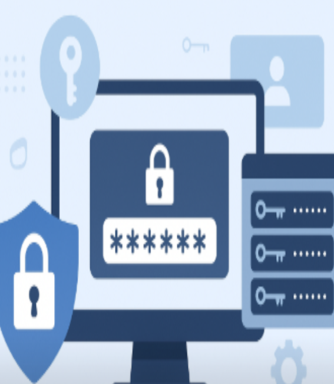

👤 Autor: Jhon Justiniano
🏫 Curs: SMX-B
🔒 Mòdul: Seguretat Informàtica

# 🧾 ÍNDEX 
- Instal·lació i Configuració Inicial: Descàrrega, instal·lació i creació de la BBDD principal o compte mestre.

- Generació de Contrasenyes Segures: Explicació de com utilitzar el generador de contrasenyes de l'eina (paràmetres, longitud, caràcters especials).

- Exemples d'Ús i Emplenament Automàtic:
  - Com desar una credencial d'un compte de correu electrònic.
  - Com desar una credencial d'una aplicació o servei web.
  - Com fer servir l’extensió del navegador per emplenar automàticament les dades.
- Gestió de Còpies de Seguretat (Backup)

# ⚙️ Instal·lació i Configuració Inicial: Descàrrega, instal·lació i creació de la BBDD principal o compte mestre.
Ens n'anem a Microsoft Store

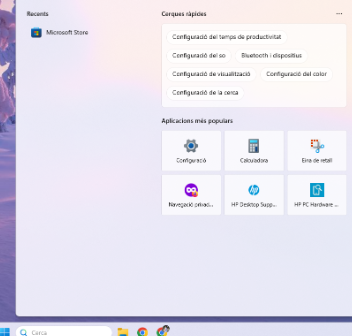

Una vegada dins busquem Bitwarden i li donem a instal·lar

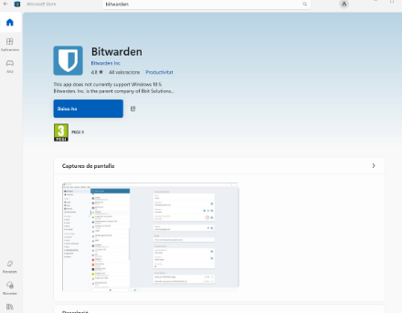

Una vegada instal·lat obrim el Bitwarden

Una vegada dins del Bitwarden li hem de donar a crear un compte

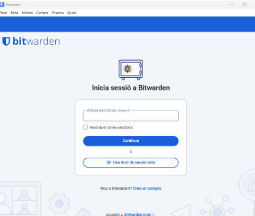

Posem el nostre correu de l'escola i el nostre nom d'usuari.

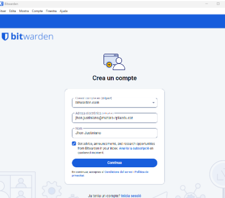

Ens hauran d'enviar un correu de verificació

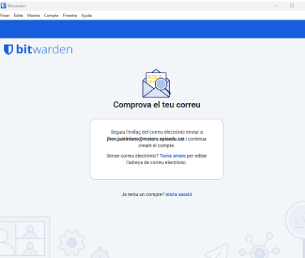

Ens n'anem al GMAIL i entrem a verificar l'email que ens han enviat

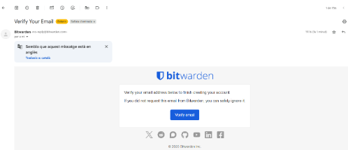

Quan entrem a verificar l'email que ens han enviat ens demana que posem la contrasenya del nostre usuari “ha de ser una contrasenya mestra”

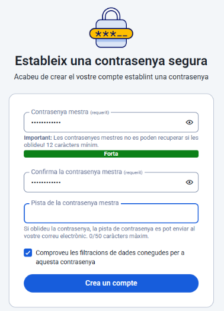

Després afegirem l'extensió a Google

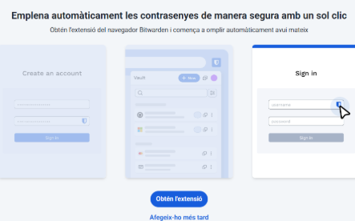

Com podem veure en la següent imatge en ser correu d'escola no ens deixa afegir l'extensió a Google, però a l'usuari sí que li deixarà.

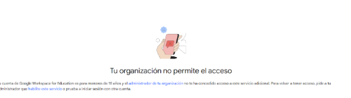

I com podem veure a continuació ja estem dins del Bitwarden

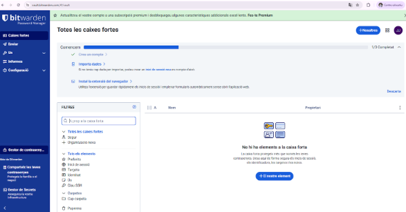

# 🔐  Generació de Contrasenyes Segures: Explicació de com utilitzar el generador de contrasenyes de l'eina (paràmetres, longitud, caràcters especials).
Una vegada dins del Bitwarden en l'apartat d'eines ens n'anem a generador i ens apareixerà la longitud, els paràmetres i els caràcters especials

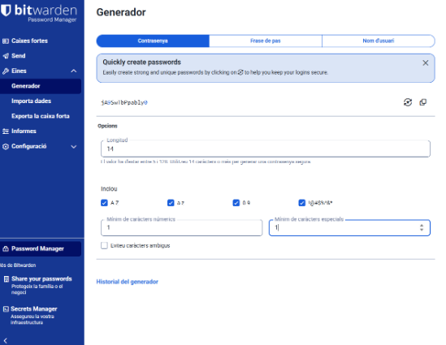

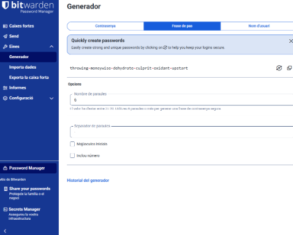

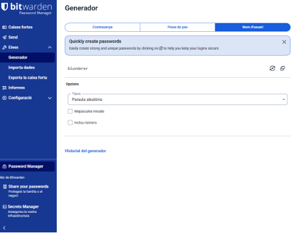

# 💡 Exemples d'Ús i Emplenament Automàtic:
## 📧 Com desar una credencial d'un compte de correu electrònic.
## 🌐 Com desar una credencial d'una aplicació o servei web.
## 🧩 Com fer servir l’extensió del navegador per emplenar automàticament les dades.

Ens n'anem a caixes fortes

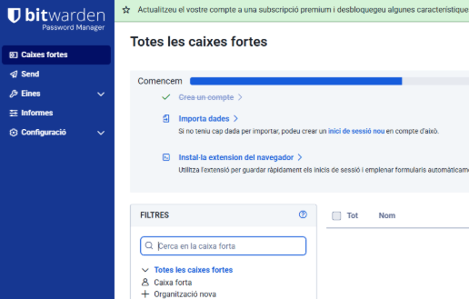

I en la part dreta del Bitwarden cliquem sobre “nou” i triem “inici de sessió”

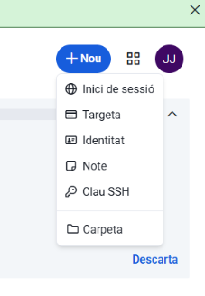

Seguidament en credencials d'inici de sessió emplenem el nostre correu i la nostra contrasenya de correu. Això és per al compte de correu electrònic

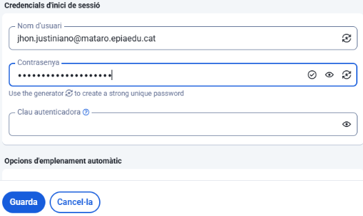

