# Solució: T04: Serveis de directori. LDAP

## 1. Objecte de l'Encàrrec

L'objecte del present Plec és la instal·lació, configuració i validació d'un servei OpenLDAP en un entorn virtualitzat basat en Ubuntu Server. Aquest servei s'ha de configurar per actuar com a directori centralitzat d'usuaris i grups per al domini de proves innovatechXX.test.

## 2. Requeriments d'Infraestructura Inicial
El consultor ha de verificar la correcta configuració de la infraestructura virtual abans d'iniciar la implementació:

## 2.1. Configuració de la màquina Server (Server Hostname). 
"server.innovatechXX.test"

- Primero entramos a la configuración ejecutando el comando: 

- Una vez entramos hemos de configurar y poner el Server Hostname y ponemos server.innovatech14.test server 

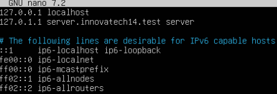

- Para asegurarnos que lo hemos hecho bien, ejecutamos el comando hostname y hostname -f

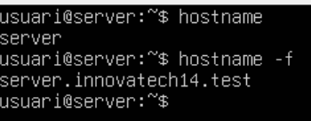

## 2.2. Interfície de Xarxa Pública.
"NAT (Per accés a Internet i descàrrega de paquets)"

- Para poner red en NAT salimos de la máquina virtual y en virtualbox nos vamos a la configuración y en el apartado de red en adaptador 1 ponemos red NAT

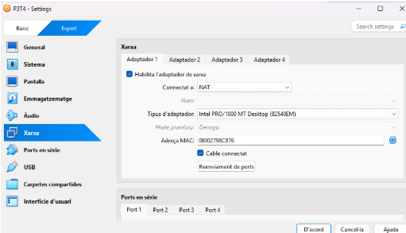

## 2.3. Interfície de Xarxa Privada.
"Host-Only (Per a comunicació privada amb el Client virtual  i la màquina física)"

- Para poner una segunda red, igual que antes entramos a la configuración y en red habilitamos el segundo adaptador y ponemos adaptador de solo anfitrión

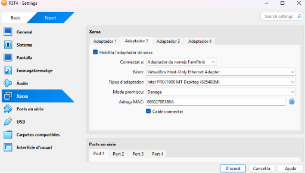

- Después hacemos el siguiente comando para entrar a la configuración y habilitar y configurar el segundo adaptador que es de sólo anfitrión, el comando es: 

- Una vez dentro ponemos el segundo adaptador lo hacemos poniendo enp0s8 y más abajo ponemos dhcp4: true para que se habilite. 

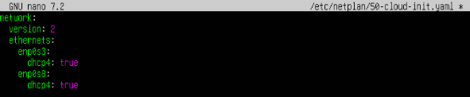

- Guardamos los cambios y hacemos la comanda sudo netplan apply para aplicar los cambios

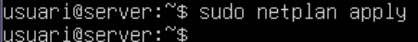

- Después de eso por último hacemos la comanda ip a para ver las ips 

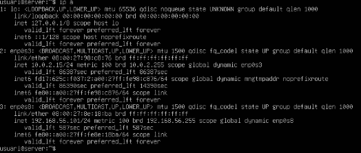

## 3. Tasques d'Implementació i Configuració del Servidor LDAP
"La Consultora EverPia ha de complir estrictament amb les següents tasques d'instal·lació i configuració:"

## 3.1. Instal·lació i Configuració Base d'OpenLDAP

## 3.1.1. Instal·lació del servei OpenLDAP.
"S'ha de mostrar el resultat de la comanda slapcat per validar la instal·lació base"

- Para instalar ejecutamos la siguiente comanda:

- Nos pedirá que pongamos una contraseña a la cuál le ponemos usuari.

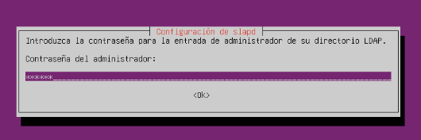

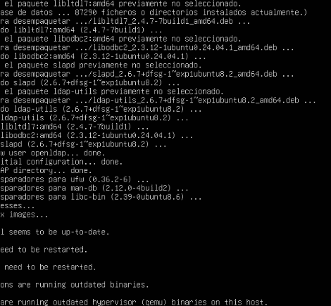

- Una vez instalado tenemos que comprobar que esté activo y en funcionamiento, lo hacemos ejecutando la siguiente comanda:

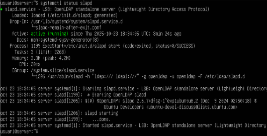

- Ahora que ya hemos visto que está activo y en funcionamiento, comprobamos que el directorio se ha creado con el nombre que queremos, para eso hacemos la comanda: sudo slapcat

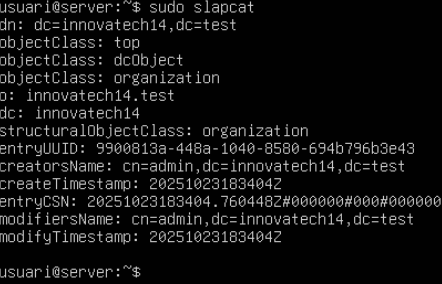

## 3.1.2. Configuració de la base de dades.
"Nom del Domini: innovatechXX.test"

- Para poner el nombre del dominio tenemos que reconfigurar, para eso ejecutamos la siguiente comanda para reconfigurar:

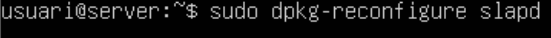

- Una vez le demos a reconfigurar nos saldrá un mensaje, al cuál le tenemos que decir “que no queremos cancelar la configuración” por tanto le tenemos que dar al “NO”

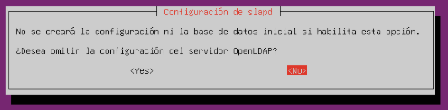

- Después le tenemos que poner el nombre correspondiente al directorio que queremos crear, en este caso ponemos: innovatech14.test” 

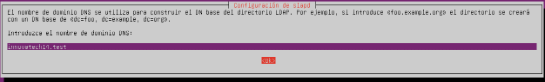

- Después ahora sí que hemos de poner el nombre de la organización, que también le he puesto innovatech14.test

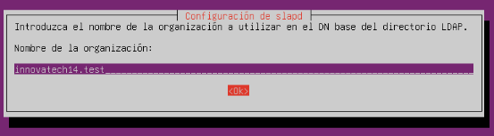

## 3.1.3. Configuració de la contrasenya d'administrador.
"Contrasenya: p@ssw0rd"

- Ponemos la contraseña, que en este caso tiene que ser y por tanto ponemos: p@ssw0rd

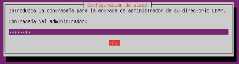

- Después nos pedirá que pongamos nuevamente para confirmar y por supuesto también ponemos: p@ssw0rd

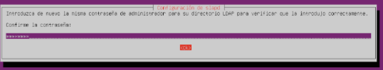

- Después le tenemos que dar a “si” por que lo que nos dice es que cuando se elimine el paquete también se elimine la BD creada 

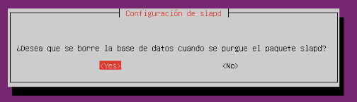

- Después le damos a “si” también por que lo que nos dice es que si queremos mover la base de datos antigua, por tanto le damos a “si” para que se nos mueva la información del directorio existente a una carpeta backup

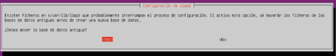

- Por último compramos que se ha modificado la información del directorio y para que este bien

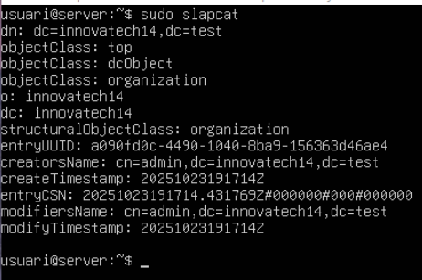

## 3.1.4. Creació d'Unitats Organitzatives (OU) inicials.
"S'han de crear dues OUs: users i groups mitjançant un fitxer .ldif"

- Para crear la OU hacemos la siguiente comanda:

- Después tenemos que poner lo que pone en la imagen, que es para crear la OU de users y de groups

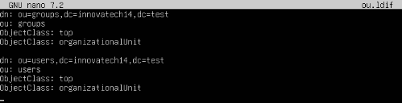

- Por último lo agregamos con la comanda siguiente:

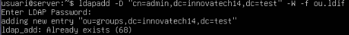

## 3.1.5. Validació de les Unitats Organitzatives.
"Realitzar una consulta amb ldapsearch que mostri totes les OUs creades al directori"

- Para que nos muestre todos los resultados, tenemos que hacer la siguiente comanda: ldapsearch -xLLL  -b “dc=innovatech14,dc=test” ou=*. “Con el ou=* le estamos diciendo que nos muestre la OU creada anteriormente”.

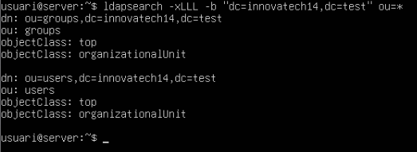

## 3.2. Gestió i Administració (LAM)

## 3.2.1. Instal·lació del Gestor d'Usuaris LDAP (LAM).
"S'ha de documentar la comanda d'instal·lació"

- Para instalar el gestor de usuarios LDAP hacemos la siguiente comanda:

- Y esperamos que se instale.

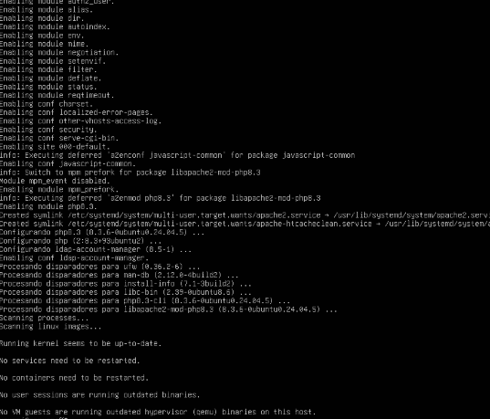

## 3.2.2. Accés Remot i Configuració.
"Connectar a LAM des de la màquina física utilitzant l'adreça IP de la interfície Host-Only"

- Para conectarnos desde la máquina física utilizando la la IP de la interficie de sólo anfitrión tenemos que hacer ip a para ver la ip para poner esa ip en la máquina física y poder conectarnos. 

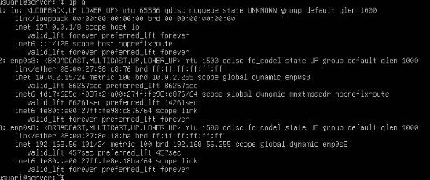

- La ip es: 192.168.56.101

- Ahora una vez tenemos la ip en el navegador de la máquina física tenemos que poner la ip + /lam

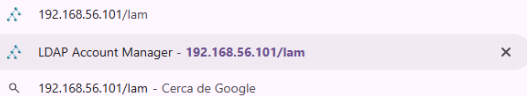

- Nos saldrá la siguiente pestaña a lo que tenemos que entrar a “la configuración de LAM”

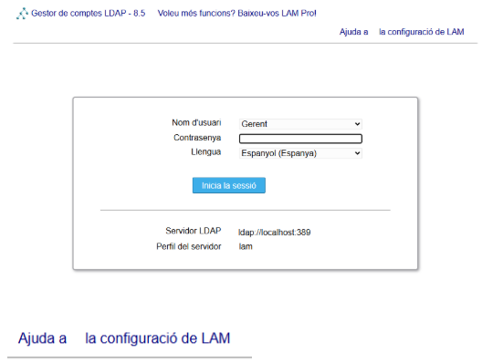

- Seguidamente entramos a “editar los perfiles del servidor”

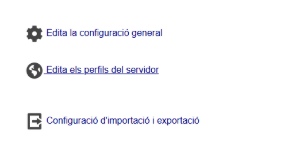

- Una vez entremos nos saldrá lo que se muestra en la imágen a continuación y la contraseña es lam “la podemos cambiar después una vez estemos dentro”

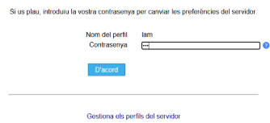

- Una vez entramos nos ponemos a configurar las opciones generales como el idioma, la zona horaria, la cuenta admin, etc.

- Primero en dirección del servidor tenemos que poner la ip, el idioma ponemos español y en lista de usuarios válidos ponemos cn=admin,dc=innovatech14,dc=test

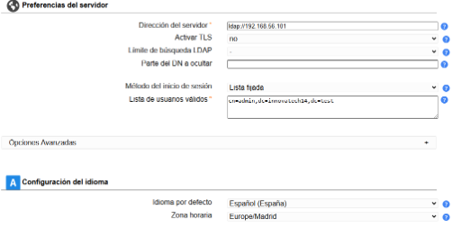

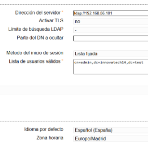

- Después en el “Tree suffix” ponemos dc=innovatech14.test,dc=test

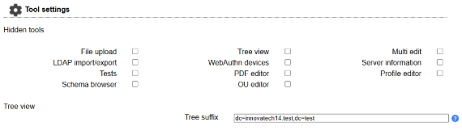

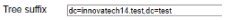

- Después por último ponemos una contraseña, en este caso yo para recordarme he puesto usuari.

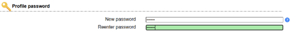

- Después de poner la contraseña le damos a guardar y nos pedirá una contraseña para poder entrar a la configuración, esa contraseña es p@ssw0rd y la contraseña que antes en la anterior captura hemos puesto es usuari, por tanto cuándo entremos nuevamente con la ip la contraseña es p@ssw0rd y si queremo configurar de nuevo para entrar es en ayuda y en edita los perfiles esa contraseña es usuari.

## 3.2.3. Configuració per defecte.
"Establir la configuració predeterminada perquè els nous usuaris s'ubiquin a l'OU users i els nous grups a l'OU groups"

- Para que los nuevos usuarios que antes hemos creado en la máquina virtual en la OU se puedan configurar entramos a tipos de cuentas.

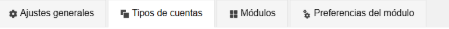

- Una vez dentro de tipos de cuentas en usuarios, en sufijo LDAP ponemos ou=users,dc=innovatech14dc=test esto tiene que ser lo mismo que pusimos en la máquina virtual cuándo creamos la OU con los usuarios y los grupos.

- En grupos lo mismo pero con groups, ponemos en sufijo LDAP ou=groups,dc=innovatech14,dc=test esto tiene que ser lo mismo que pusimos en la máquina virtual cuándo creamos la OU con los usuarios y los grupos.

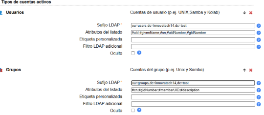

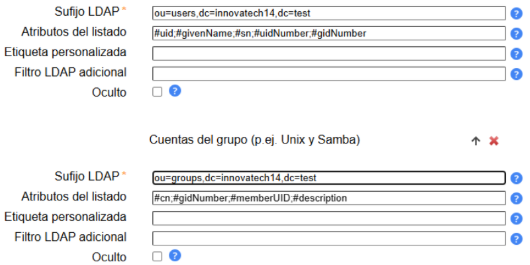

## 3.2.4. Creació de Grups.
"Crear dos grups de seguretat al directori: tech i manager"

- Entramos a grupos y le damos a crear nuevo grupo, ponemos el nombre que en este caso es tech y de damos a guardar.

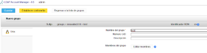

- Para el otro grupo lo mismo entramos a grupos y le damos a crear nuevo grupo, ponemos el nombre que es manager y por último le damos a guardar.

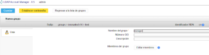

- Para verificar que se hayan creado los dos grupos miramos que estén los dos:

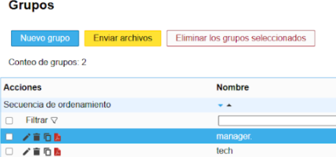

## 3.2.5. Creació d'Usuaris de Prova.
"Crear un usuari per a cada grup: tech01 (membre de tech) i manager01 (membre de manager)"

- Para crear los usuarios, nos vamos a usuarios y le damos a crear entonces ponemos de nombre tech01 y de apellidos lo mismo tech01.

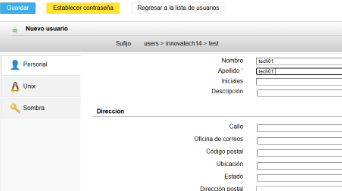

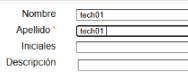

- Después en la parte lateral izquierda pone tres menús, entramos a donde pone Unix y le ponemos en grupo primario le ponemos “crear grupo con mismo nombre”

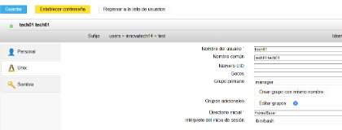

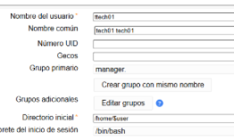

- Y se nos pondrá ttech01.

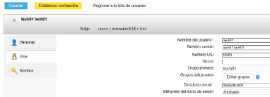

- Le asignamos una contraseña y le damos guardar.

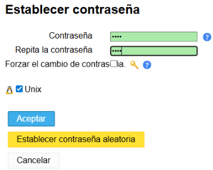

- Para crear el segundo usuario lo mismo, le damos crear nuevo usuario y en nombre ponemos manager01 y en apellido lo mismo ponemos manager01. 

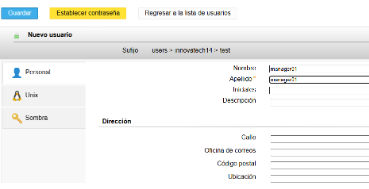

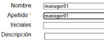

- Y en el menú de la izquierda en Unix ponemos igual que en el anterior usuario, ponemos en grupo primario “crear grupo con mismo nombre”

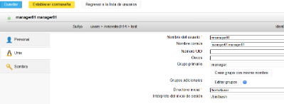

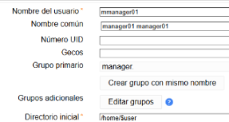

- Y se nos pondrá mmanager01.

- Le asignamos una contraseña y le damos guardar.

- Para verificar que se hayan creado bien, nos vamos a usuarios y nos tendrían que salir los dos usuarios creados.

- Ahora miramos que estén bien creados los usuarios y los grupos:

## 4. Integració de Client (Client Ubuntu Desktop)

## 4.1. Instal·lació del Client.
"Instal·lar un client Ubuntu Desktop i configurar la interfície de xarxa per comunicar-se amb el servidor (Host-Only)"

- Para eso creamos una nueva máquina virtual desde virtualbox ponemos el nombre, donde la queremos guardar y la iso que en este caso es de zorin. El enunciado dice que es ubuntu pero el profesor nos dijo que lo podríamos hacer con zorin.

- Después en la configuración de la máquina en redes ponemos adaptador 1 en NAT.

- Seguidamente habilitamos el segundo adaptador que en este caso lo pondremos en solo anfitrión para que se comunique con el servidor. 

- Después entramos y hacemos toda la instalación y etc. Una vez dentro desde la terminal hacemos ip a para ver la ip y que se nos haya puesto correctamente. 

## 4.2. Resolució de Noms.
"Configurar l'arxiu d'hosts del client per resoldre l'adreça IP del servidor a server.innovatechXX.test. S'ha de proporcionar una instantània (snapshot) de la màquina client un cop fet el canvi"

- Primeramente antes de todo hacemos la instantánea, para eso apagamos la máquina entramos a las tres rayas y clicamos obviamente donde dice instantáneas y le damos a hacer.

- Nos saldrá una pestaña como la siguiente y le damos de acuerdo.

- Ahora tenemos que entrar osea iniciar la máquina y abrimos la terminal nuevamente y hacemos las actualizaciones antes de todo. 

- Ahora si comenzamos con lo que nos pide, para eso hacemos ip a para ver la ip.

- Una vez ya sabemos la ip hacemos sudo nano /etc/host para editar el archivo.

- Una vez dentro del archivo tenemos que poner la 2da y la 3ra línea que en la segunda línea lo que hacemos es que ponemos el hostname del cliente que será cliente.innovatech14.test cliente. En la tercera línea ponemos la ip del servidor que será 192.168.565.101 es 101 por qué es el servidor y el del cliente es 102.

- Después entramos a sudo nano /etc/hostname para poner el hostname.

- Dentro tenemos que poner el hostname del cliente que será cliente.innovatech14.test

- Seguidamente comprobamos que funcionen correctamente los nombres, para eso hacemos hostname -f y dig server.innovatech14.test

## 4.3. Mòduls d'Autenticació.
"Instal·lar els mòduls necessaris per permetre l'autenticació amb LDAP"

- Instalamos los módulos necesarios con la siguiente comanda:

- Ponemos nuestro dominio:

- Seguimos con la configuración y en este caso ponemos dc=innovatech14,dc=test

- En la versión da igual cuál pongamos.

- Seguimos y en este caso ponemos “si”

- En la siguiente ponemos “no”

- Verificamos que este bien y le damos aceptar:

- Y por últimos ponemos una contraseña:

## 4.4. Validació de la Connectivitat LDAP.
"Comprovar la connectivitat amb el servidor fent una consulta ldapsearch des del client"

- Para comprobar hacemos la siguiente comanda:

## 4.5. Configuració del Client.
"Modificar els arxius de configuració del client necessaris. S'han de mostrar clarament els canvis realitzats en el codi dels arxius"

- Para modificar el archivo hacemos la siguiente comanda:

- Una vez dentro lo que editamos es lo que pone el la siguiente imágen, “en la imagen ya esta cambiado”

- Para editar el otro archivo hacemos la comanda: 

- Aquí eliminamos la línea del término use_authtok

- Ahora editamos el siguiente archivo y añadimos la línea indicada, para entrar hacemos la comanda: 

## 4.6. Comprovació del Sistema
"Reiniciar els serveis i verificar amb la comanda getent passwd que els usuaris del directori són visibles localment"

- Reiniciamos el servicio con systemctl restart nscd:

- Hacemos la comanda getent passwd | tail para ver si los usuarios son visibles

- Después tenemos que editar el archivo indicado para que se pueda iniciar con el entorno gráfico.

- Una vez dentro añadimos la línea indicada.

## 4.7. Prova d'Accés Final
"Reiniciar el client i iniciar sessió amb l'usuari tech01. Es requereix una captura de pantalla que demostri l'accés correcte i la creació automàtica de la carpeta personal de l'usuari"

- Estamos en la recta final y tenemos que comprobar que podemos entrar con los usuarios.

- Le damos a no está en esta lista.

- Ponemos el nombre de usuario y la contraseña que le asignamos anteriormente en la configuración de loam desde la máquina física. La contraseña es 1234 para los dos usuarios.

- Y hacemos lo mismo con el otro usuario, en las siguientes imágenes vemos que con los dos usuarios podemos entrar.

- Hacemos id en los dos usuarios para comprobar que se le ha creado la carpeta personal.

[Torna a l'enunciat](README.md)

