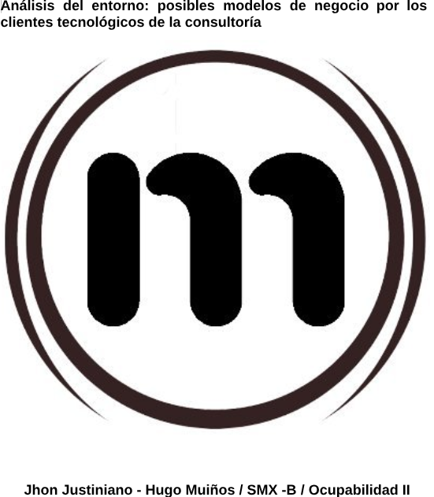
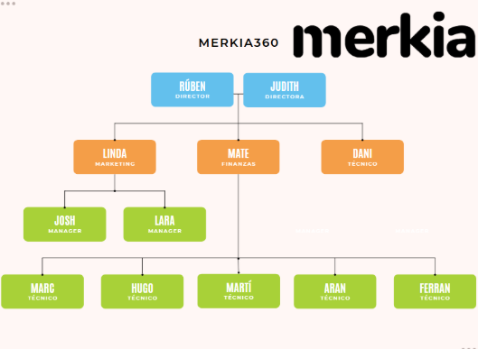
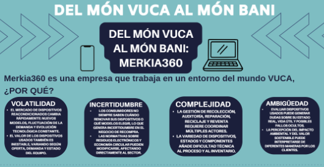
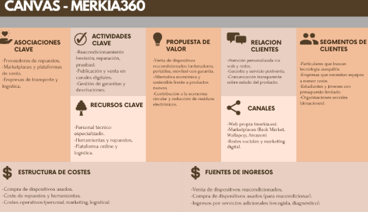
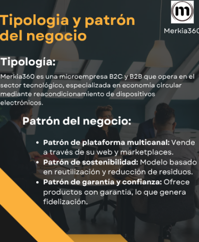
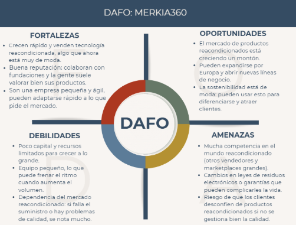
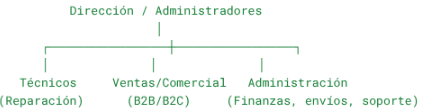
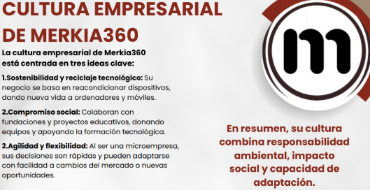
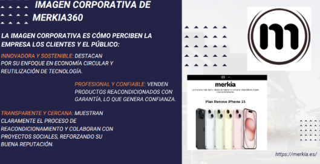
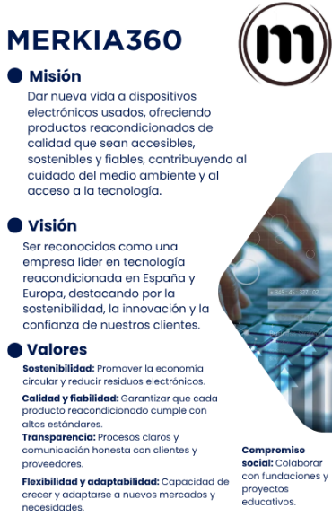

# Solució: T05: Anàlisi de l’entorn: possibles models de negoci pels clients tecnològics de la consultoria

## Índice:
1.Organigrama de la empresa

2.Analizar el entorno real de la empresa. microentorno y macroentorno.

3.Definir los cambios del entorno de la empresa

4.Del mundo VUCA al mundo BANI

5.Hacer el CANVAS del modelo de negocio de vuestro cliente para definir como la empresa crea y capta valor y lo ofrece a sus clientes

6.Descripción de la tipología y patrón del negocio

7.Aplicar la inteligencia artificial al diseño del modelo de negocio

8.DAFO para comprobar la viabilidad potencial del cliente. Planificación de la estrategia de futuro

9.La empresa como sistema. Áreas funcionales de la empresa. Funcionamiento de la empresa. La estructura organizativa de la empresa.

10.La cultura empresarial y la imagen corporativa.

11.Misión, visión y valores de la empresa.

12.Acciones concretas y RSC. Balance social

## 1.Organigrama de la empresa

## 2.Analizar el entorno real de la empresa. microentorno y macroentorno.

### Microentorno Merkia360:

El microentorno está formado por los factores más cercanos a la empresa, aquellos con los que tiene contacto directo y que influyen en su operación diaria y su capacidad de satisfacer a los clientes.

Principales elementos del microentorno de Merkia360:

**Proveedores:**
- Son quienes suministran piezas, herramientas o componentes para la reparación de dispositivos.

- Ejemplo: distribuidores de baterías, pantallas, cargadores o repuestos originales y genéricos.

- La disponibilidad, calidad y precio de estos insumos impacta directamente en la rentabilidad de Merkia360.

**Clientes:**
- Personas o empresas que compran dispositivos reacondicionados buscando una alternativa más económica y sostenible frente a los nuevos.

- También pueden ser clientes que venden sus dispositivos usados para que Merkia360 los reacondiciona.

- Conocer sus hábitos de consumo (por ejemplo, preferencia por marcas como Apple o Samsung) es clave.

**Competencia:**
- Otras empresas que se dedican a la compra, reparación y venta de dispositivos reacondicionados.

- También los fabricantes que venden productos nuevos a precios rebajados pueden ser competencia indirecta.

- Ejemplo: Back Market, Cash Converters o tiendas locales de segunda mano.

**Intermediarios o distribuidores:**
- Plataformas de venta online (como Amazon, Wallapop o la propia web de Merkia360) que facilitan la llegada del producto al consumidor.

- La relación con estos intermediarios afecta el alcance y la imagen de la empresa.

**Públicos:**
- Son grupos que pueden influir en la reputación de Merkia360, como medios de comunicación, influencers tecnológicos o asociaciones de consumidores.

- También entran los empleados, inversores o incluso autoridades locales.

### Macroentorno Merkia360:

El macroentorno de Merkia360 se refiere a esos factores externos, amplios y fuera de nuestro control que impactan el entorno en el que la empresa opera. Estos elementos tienen un efecto significativo en el mercado en general.

**Económico:**

- Aspectos como la inflación, el poder adquisitivo y las tasas de desempleo juegan un papel crucial en la demanda. Durante tiempos de crisis, es común que los consumidores opten por productos reacondicionados en lugar de nuevos.

**Tecnológico:**

- La rapidez con la que avanza la innovación en dispositivos electrónicos es impresionante. Cuanto más rápido evoluciona la tecnología, más oportunidades surgen para reacondicionar modelos recientes que todavía son útiles. Además, los avances en herramientas de diagnóstico y reparación también son relevantes.

**Sociocultural:**

- Hay una creciente conciencia sobre la ecología y una preocupación por el reciclaje y la sostenibilidad. Muchos consumidores prefieren elegir productos reacondicionados para disminuir su huella ambiental.

**Político-legal:**

- Las legislaciones sobre residuos electrónicos (RAEE) y las normas de garantía para productos reacondicionados son fundamentales. Es vital cumplir con las regulaciones de protección al consumidor y etiquetado.

**Demográfico:**

- Los jóvenes y los estudiantes suelen inclinarse por dispositivos reacondicionados debido a su menor precio. También hay un público adulto que busca calidad a un costo más accesible.

**Natural o ecológico:**

- La correcta gestión de residuos electrónicos y materiales reciclables es esencial. Adoptar un enfoque ecológico no solo mejora la imagen de la marca, sino que también se alinea con la tendencia hacia un consumo más responsable.

## 3.Definir los cambios del entorno de la empresa

| Estabilidad | Complejidad | Hostilidad |
|-------------|-------------|------------|
| Estable     | Simple      | Hostil     |
| Dinámico    | Complejo    | Favorable  |
| **¿Por qué?** | **¿Por qué?** | **¿Por qué?** |
| **Estable:** - Está constituida legalmente como una sociedad limitada (SL), está en Cabrera de Mar. - Su actividad está muy bien definida: comercio de equipos informáticos. - En los últimos años se ha observado un crecimiento, como por ejemplo: en 2023 sus ventas aumentaron un 62,82 %.  - Tiene una buena estrategia de sostenibilidad y de reutilización, lo cual es “economía circular”. | **Compleja:** - Tiene un buen modelo de negocio múltiple, ya que no solo venden dispositivos reacondicionados, sino que también ofrecen una buena valoración de los dispositivos, recogida, revisión, tienen garantía, y compran y venden dispositivos. - Grados de los productos: Los equipos que reacondicionan son catalogados como buenos y muy buenos. | **Hostil:** - Mercado competitivo: El sector de los productos reacondicionados está creciendo cada vez más, pero también tiene muchos actores, es decir, hay competencia. - Margen de excelencia: Al vender, los costes de los productos reacondicionados aumentan ya que los clientes exigen calidad. - Requisitos reglamentarios: Deben cumplir las normativas de protección de datos. |

En conjunto el entorno del negocio exige que la empresa sea ágil, resiliente y gestionada de una manera perfecta o casi perfecta.

## 4.Del mundo VUCA al mundo BANI

## 5.Hacer el CANVAS del modelo de negocio de vuestro cliente para definir como la empresa crea y capta valor y lo ofrece a sus clientes

## 6.Descripción de la tipología y patrón del negocio

## 7.Aplicar la inteligencia artificial al diseño del modelo de negocio
La IA puede potenciar el modelo de Merkia360 en varias áreas:

- **Optimización de precios dinámicos**
  - Algoritmos que ajusten precios según demanda, competencia y stock.
- **Predicción de demanda y gestión de inventario**
  - IA para prever qué dispositivos tendrán mayor rotación y planificar compras.
- **Clasificación automática del estado del dispositivo**
  - Visión artificial para evaluar desgaste, arañazos y estado físico.
- **Chatbots y atención al cliente**
  - IA conversacional para resolver dudas, gestionar garantías y ventas.
- **Marketing personalizado**
  - Sistemas de recomendación basados en el comportamiento del cliente.
- **Detección de fraude y seguridad**
  - IA para validar dispositivos y evitar compras fraudulentas.

## 8.DAFO para comprobar la viabilidad potencial del cliente. Planificación de la estrategia de futuro

## 9.La empresa como sistema. Áreas funcionales de la empresa. Funcionamiento de la empresa. La estructura organizativa de la empresa.

### La empresa como sistema (aplicado a Merkia360)
Merkia360 funciona como un sistema donde todas las partes trabajan juntas para transformar dispositivos usados en productos reacondicionados listos para vender.

- **Entradas:** ordenadores/móviles usados, personal técnico, información, dinero.

- **Procesos:** revisión, reparación, pruebas, gestión de pedidos, venta.

- **Salidas:** productos reacondicionados, servicio al cliente, garantías.

Si una parte falla (calidad, logística, ventas…), todo el sistema se ve afectado.

### Áreas funcionales de Merkia360
Aunque es una microempresa, se pueden distinguir las áreas básicas:

- **a) Área de compras y producción**
  - Adquisición de equipos usados o lotes de dispositivos.
  - Reacondicionamiento: limpieza, sustitución de piezas, pruebas técnicas.
  - Control de calidad y preparación de productos para envío.

- **b) Área comercial y marketing**
  - Publicación de productos en plataformas (por ejemplo, Back Market).
  - Comunicación de la marca y promociones.

- **c) Área administrativa y financiera**
  - Facturación, pagos y cobros.
  - Gestión de garantías, devoluciones y proveedores.
  - Control de costes y planificación económica.

### Funcionamiento de la empresa
El funcionamiento típico sería:

- Recepción de productos usados.
- Evaluación técnica para decidir si se pueden reparar.
- Reparación o sustitución de piezas (batería, SSD, pantalla…).
- Pruebas finales para garantizar la calidad.
- Publicación y venta en marketplaces o a clientes directos.
- Envío + garantía y gestión de posibles devoluciones.

### Estructura organizativa de Merkia360 (aproximada)
Al ser una microempresa, su estructura es simple y vertical:

- Dirección: toma decisiones y define la estrategia.
- Técnicos: reacondicionan y verifican los dispositivos.
- Ventas: gestionan clientes, pedidos y presencia en marketplaces.
- Administración: facturas, logística, garantías y atención al cliente.

## 10.La cultura empresarial y la imagen corporativa.

## 11.Misión, visión y valores de la empresa.

## 12.Acciones concretas y RSC. Balance social

### Acciones concretas
Merkia360 realiza varias acciones destacadas dentro de su actividad:

- **Reacondicionamiento de dispositivos:** Ordenadores, portátiles y móviles usados que se reparan y se venden como productos de calidad.
- **Donaciones a fundaciones:** Entrega de equipos reacondicionados a proyectos educativos y sociales, como la Fundación Gomaespuma.
- **Participación en marketplaces sostenibles:** Venden productos reacondicionados en plataformas como Back Market, fomentando la reutilización tecnológica.

### Responsabilidad Social Corporativa (RSC)
Su RSC se centra en tres ejes principales:

- **Medioambiental:** Reducen residuos electrónicos mediante el reacondicionamiento y la economía circular.
- **Social:** Apoyan la educación y el acceso a la tecnología a través de donaciones y colaboraciones con fundaciones.
- **Ética y transparencia:** Garantizan la calidad de sus productos reacondicionados y mantienen una comunicación clara con clientes y proveedores.

### Balance social (resumen)
Aunque es una microempresa, Merkia360 muestra impactos positivos:

- **Ecológico:** Reducción de residuos y fomento del consumo responsable de tecnología.
- **Social:** Más de 100 dispositivos donados a fundaciones y proyectos educativos (ejemplo Fundación Gomaespuma).
- **Económico:** Generan empleo y negocio local, con posibilidad de expansión internacional.

