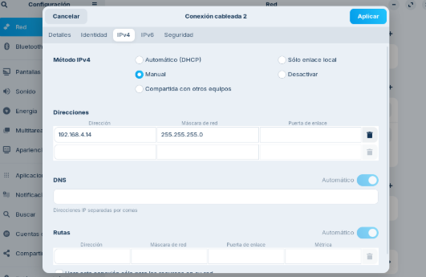
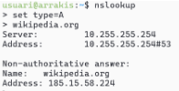

# Solució: T06: Fonaments del servei DNS - Fase Pràctica: Diagnosi de Noms (Auditoria amb CLI)
Heu de demostrar l'ús de les principals utilitats de diagnosi DNS en els diferents sistemes operatius que utilitza el client (Linux/macOS i Windows).

Per a cada eina, executeu les comandes indicades a continuació contra el domini que s’indiqui explícitament i captureu/analitzeu els resultats.

Per fer aquest demostració, caldrà usar un equip Zorin amb dues interfícies, la primera en NAT i la segona en adaptador pont amb la IP correctament configurada segons indicacions dels vostres responsables.

- Les dues interfícies, la primera en NAT ja es posa automàticament quan creem la màquina, el segon ho hem de posar, per això des de VirtualBox entren a configuracions i en xarxa hem de posar i habilitar el segon adaptador.
- Després d’això des de dintre de la màquina en configuracions entren a xarxa i seleccionen l’adaptador  i entren a IPv4 i ho hem de posar manual com poden veure en les següents captures:

- Una vegada ho podem li donem afegir i per confirmar entren un altre cop i ha d'estar com la següent captura:

## A. Diagnosi Avançada amb dig (Linux / macOS)
### Comanda 1: Consulta Bàsica de Registre A

- Executa dig xtec.cat A

- Anàlisi: Identifica la IP de resposta, el valor TTL i el servidor que ha respost a la consulta.

L’IP de la resposta és: 83.247.151.214

El valor TTL és: 1720

Servidor que ha posat a la consulta: 127.0.0.53

### Comanda 2: Consulta de Servidors de Noms (NS)

- Executa dig tecnocampus.cat NS

- Anàlisi: Quins són els servidors de noms autoritatius per a aquest domini?

Els servidors autoritzats per aquest domino són:

-ns-1689.awsdns-19.co.uk

-ns-535.awsdns-02.net

-ns-1071.awsdns-05.org

-ns-130.awsdns-16.com

### Comanda 3: Consulta Detallada SOA

- Executa dig escolapia.cat SOA

- Anàlisi: Quina és la informació del correu de l'administrador i el número de sèrie del domini?

Correu de l’administrador: 

-root.dns1.nominalia.com : En els registres, el correu és representa amb un punt en lloc de @.

Número de sèrie del domini:

-1761028965

### Comanda 4: Consulta resolució inversa

- Executa comanda dig -x 147.83.2.135

- Anàlisi: Quina informació sobre els registres s’obté?

S’obté que la IP 147.83.2.135 está asociada a molts noms de domini:

-barcelonatech.upc.edu

-barcelonatech-upc.edu

-upc.cat

-ediciodeweb.produccio.upc.edu

-upc.edu

-masters.upc.edu

-www.upc.es

-saladepremsa.upc.edu

## Comprovació de Resolució amb nslookup (Multiplataforma)

L’eina nslookup es troba a pràcticament a qualsevol sistema operatiu. Es pot usar de forma similar a dig incloent l’argument o si s’executa nslookup sense arguments, entrar en el mode interactiu, us apareix un prompt (>). Serà aquest mode el que explorareu . 

El mode és força senzill, bàsicament hi ha tres comandes a usar:

- set type= per indicar el tipus de consulta: A, AAA, MX, NS, SOA, TXT o ALL.
- server IP on IP és la IP del servidor de noms al que es vol fer la consulta, també es pot indicar el nom del servidor enlloc de la IP, per exemple, server a9-66.akam.net.
- exit que serveix per sortir de la comanda.

